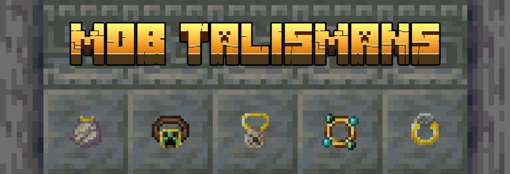

#   

NeoForge mod for Minecraft Java 1.21.1 that adds wearable accessories to counteract annoying mob mechanics.  
**Requires the mod [Accessories.](https://modrinth.com/mod/accessories/versions?l=neoforge&g=1.21.1)**  
  
Also available on <a href="https://modrinth.com/mod/mob-mementos">Modrinth</a> & <a href="https://www.curseforge.com/minecraft/mc-mods/mob-mementos">CurseForge</a>

---

### [Wiki](https://github.com/the-drunken-cod/Mob-Mementos/wiki) &bull; [Content](#content) &bull; [Intents&nbsp;&amp;&nbsp;Goals](#intents--goals) &bull; [Installation](#installation) &bull; [Modpack&nbsp;Policy](#modpack-policy) &bull; [Ideas&nbsp;&amp;&nbsp;Roadmap](#ideas--roadmap) &bull; [Attribution](#attribution) &bull; [Disclaimer](#disclaimer) &bull; [Licenses](#licenses)

---

 

## Content
- **Conduit Necklace**: hurts aggressive aquatic mobs in the vicinity
- **Creeper Belt**: prevents nearby creepers from doing block damage
- **Enderman Anklet**: prohibits nearby endermen from picking up blocks
- **Silverfish Bangle**: converts infested blocks nearby to their non-infested variant
- **Phantom Cloak**: deters phantoms, just like cats do

 

## Intents & Goals
- Provide useful utilities against annoying mobs or unwanted game mechanics
- Enhance gameplay without conveying a feeling of becoming too overpowered or trivializing mob interactions
- Be modpack and contribution friendly (many config options, easy gating of progression when altering recipes, resources licensed under MIT, etc.)

 

## Installation
1. Create a **Minecraft Java Edition 1.21.1 instance with [the NeoForge modloader.](https://neoforged.net/)**  
  Using a launcher like [ATLauncher](https://atlauncher.com/) or [MultiMC](https://multimc.org/) will simplify this process.
2. Download the latest Mob Mementos mod jar from the [**releases page**](https://github.com/the-drunken-cod/Mob-Mementos/releases) (or add it via your launcher).
3. Download the latest version of the mod [**Accessories**](https://modrinth.com/mod/accessories/versions?l=neoforge&g=1.21.1) (or add it via your launcher).
4. Place both .jar files into the `mods` folder of your Minecraft instance if you have downloaded them manually.  
  If the folder doesn't exist yet, you can create it yourself.
5. Launch the game and enjoy!  
  After launching, you can modify the config file via the in-game options menu (Mods > "Mob Mementos" > Config) or by editing the file located at `config/mob_mementos-startup.toml` in your Minecraft instance folder.  
  A restart might be required for the more fundamental changes to take effect (i.e. item properties like durability, enabling/disabling items, etc.).

- If you're hosting a server, make sure to install both Mob Mementos and Accessories on the server as well.

 

## Modpack Policy
You are free to use Mob Mementos in any modpacks; public or private :)  
Just make sure you abide by [our licenses](#licenses), common sense, and [the Minecraft EULA.](https://minecraft.net/en-us/eula)  
Please also [report any issues or suggestions](https://github.com/the-drunken-cod/Mob-Mementos/issues), so we can improve the mod for you and other players and have better compatibility with other mods.

 

## Ideas & Roadmap
- &lt;P1&gt; Accessories that are somewhat expensive to make that make mobs less annoying or offer other utilities tied to mobs
    - [x] &lt;P1&gt; Durability that is used up when the effect triggers
    - [x] &lt;P1&gt; Mementos:
        - [x] &lt;P1&gt; **Conduit Necklace**: hurts aggressive aquatic mobs in the vicinity
        - [x] &lt;P1&gt; **Creeper Belt**: prevents nearby creepers from doing block damage
        - [x] &lt;P1&gt; **Enderman Anklet**: prohibits nearby endermen from picking up blocks
        - [x] &lt;P1&gt; **Silverfish Bangle**: converts infested blocks nearby to their non-infested variant
        - [x] &lt;P1&gt; **Phantom Cloak**: deters phantoms, just like cats do
    - [ ] &lt;P2&gt; Rendering models
    - [ ] &lt;P2&gt; Recharging mechanic
    - [ ] &lt;P3&gt; Mob soul capturing mechanic to fabricate or recharge mementos
    - [ ] &lt;P4&gt; More Mementos:
        - [ ] &lt;P4&gt; **Bat** (glasses): prevents bats from spawning nearby
        - [ ] &lt;P4&gt; **Bee**: prevents beehives from becoming agitated when harvesting or breaking them
        - [ ] &lt;P4&gt; **Frog**: nearby frogs drop froglight when eating normal slimes
        - [ ] &lt;P4&gt; **Ghast**: reflects ghast fireballs
        - [ ] &lt;P4&gt; **Glow Squid** (face/hat): underwater night vision
        - [ ] &lt;P4&gt; **Hoglin**: repels hoglins like warped fungi
        - [ ] &lt;P4&gt; **Piglin**: prevents nearby piglins from becoming hostile when not wearing gold armor, opening chests or mining gold
        - [ ] &lt;P4&gt; **Shulker**: applies slow falling after levitation runs out
        - [ ] &lt;P4&gt; **Vex**: makes vex despawn faster (or smaller radius around their summoning evoker)
        - [ ] &lt;P4&gt; **Wandering Trader** (charm): prevents wandering traders from spawning in a big radius
        - [ ] &lt;P4&gt; **Warden** (shoes): nearby shriekers have a chance to not activate, nearby wardens can't sniff for the player anymore
        - [ ] &lt;P4&gt; **Zombie** (charm): permanently makes nearby zombies unable to spawn reinforcements and break down doors
- [ ] &lt;P5&gt; Support for newer 1.21.x versions
- [ ] &lt;P6&gt; Placeable Charms / Totems:
    - **Evoker**: placed near beds & respawn anchors to make them a fallback spawnpoint
        - Any other bed can be used as a temporary spawnpoint, but if they're broken, the player will respawn at their fallback bed/anchor
        - Chat message when the charmed bed/anchor is used or broken to inform the player
        - Configurable amount of uses before the charm breaks or needs to be recharged
- [ ] &lt;P7&gt; Fabric Support

 

## Attribution
- Banner font created with [textstudio.com](https://www.textstudio.com/logo/minecraft-logo-generator-697)

 

## Disclaimer
NOT AN OFFICIAL MINECRAFT PRODUCT. NOT APPROVED BY OR ASSOCIATED WITH MOJANG OR MICROSOFT.

This program is distributed in the hope that it will be useful, but WITHOUT ANY WARRANTY; without even the implied warranty of MERCHANTABILITY or FITNESS FOR A PARTICULAR PURPOSE. See the GNU Affero General Public License for more details.

 

## Licenses
Code is licensed under the [AGPL-3.0-only.](./LICENSE.txt)  
Original resources and assets (in `src/main/resources/`) are licensed under [MIT](src/main/resources/LICENSE.txt) unless otherwise stated.
